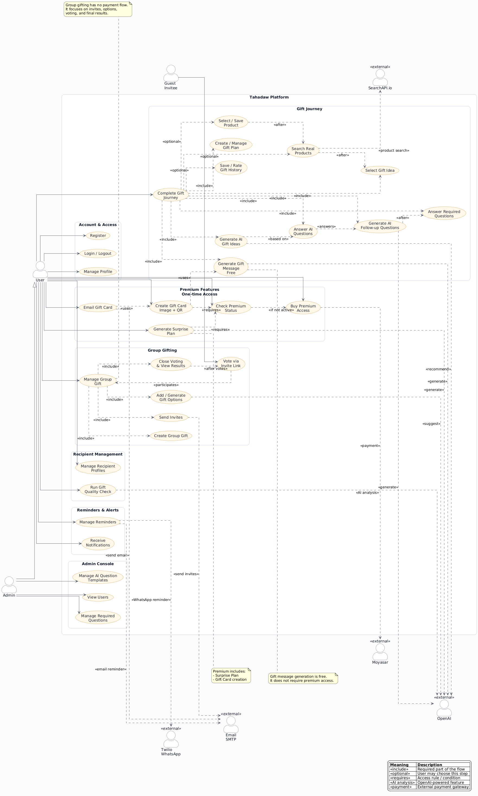

# Tahadaw — Intelligent Gift Planning & Gift Card Platform

**Tahadaw** is a Spring Boot backend that helps people plan the perfect gift. It builds rich recipient
profiles, asks smart required and AI-generated follow-up questions, recommends gift ideas, searches real
products, generates heartfelt gift messages and premium gift cards (with QR codes), runs group-gift
voting, tracks gift history, and sends reminders — all powered by OpenAI and a Moyasar payment flow for
premium features.

> **نبذة بالعربية**
> **تهدّاو** هو نظام  (Backend) مبني على Spring Boot يساعد المستخدم على تخطيط الهدية المثالية.
> انشئ ملفًا تعريفيًا عن المُهدى إليه، التطبيق سيطرح أسئلة إلزامية وأسئلة ذكية مولّدة بالذكاء الاصطناعي،
> ثم يقترح أفكار هدايا للمُهدى إليه بناءًا على ملف المهدى إليه و اجاباتك على الاساله المولده من الذكاء الاسطناعي ويبحث عن منتجات حقيقية ،
> ويولّد رسائل تهنئة وبطاقات هدايا مميّزة مع رمز كيو ار،
> ويدير التصويت على الهدايا الجماعية، ويتتبّع سجل الهدايا، ويرسل التذكيرات — مدعومًا بالذكاء الاصطناعي
> من OpenAI ونظام دفع Moyasar للميزات المدفوعة (Premium).

---

## Table of Contents

- [Overview](#overview)
- [Tech Stack](#tech-stack)
- [External Integrations](#external-integrations)
- [Prerequisites](#prerequisites)
- [Getting Started](#getting-started)
- [Configuration](#configuration)
- [Project Structure](#project-structure)
- [UI Design (Figma)](#ui-design-figma)
- [System / Use Case Diagram](#system--use-case-diagram)
- [Entity Relationship Diagram](#entity-relationship-diagram)
- [Team Contributions](#team-contributions)
- [API Base URL](#api-base-url)
- [Postman API Documentation](#postman-api-documentation)

---

## Overview

Tahadaw uses HTTP Basic authentication; the signed-in user comes from the Spring Security principal.

| Role | Description |
|------|-------------|
| **User** | Manages recipients and gift plans, answers questions, gets AI recommendations, searches products, generates messages and gift cards, runs group gifts, tracks history, and sets reminders |
| **Admin** | Manages the required-question catalog and raw AI question/answer tooling |

Main feature areas:

- **Gift Journey** — recipient profiles → gift plan → required & AI questions → AI gift ideas → real product search → selection → gift message.
- **Premium Features** — premium gift cards (image + QR), surprise plans, unlocked via a Moyasar one-time payment.
- **Group Gifting** — create a group gift, add/AI-generate options, send invites, public token-based voting, results.
- **Engagement** — gift history & spending insights, reminders (email / WhatsApp / in-app), notifications, and an aggregated dashboard.

---

## Tech Stack

| Layer | Technology |
|-------|------------|
| Language | Java 17 |
| Framework | Spring Boot 4.1.0 |
| Web | Spring MVC + Spring WebFlux (`RestClient`) |
| Security | Spring Security (HTTP Basic auth, BCrypt) |
| Persistence | Spring Data JPA / Hibernate |
| Database | MySQL (`mysql-connector-j`) |
| Validation | Jakarta Bean Validation |
| Object Mapping | ModelMapper |
| JSON | Jackson |
| Email | Spring Mail (SMTP) |
| PDF | OpenPDF (LibrePDF) |
| QR Codes | Google ZXing (`core` + `javase`) |
| Scheduling | Spring `@Scheduled` (reminder jobs) |
| Boilerplate | Lombok |
| Build | Maven (`mvnw` wrapper) |
| Testing | Spring Boot Test, Spring Security Test, JPA Test |

---

## External Integrations

| Integration            | Purpose |
|------------------------|---------|
| **OpenAI** (`gpt-5-5`) | Required/AI follow-up questions, gift idea recommendations, gift messages, surprise plans, group-gift options, gift quality checks |
| **Moyasar**            | Premium one-time payment gateway (sandbox) with 3‑D Secure browser callback + webhook |
| **SearchAPI.io**       | Real product search (Google Shopping) for selected gift ideas |
| **Twilio**             | WhatsApp reminder notifications |
| **SMTP Email**         | Gift card delivery, payment receipts, group-gift invites |

---

## Prerequisites

- **Java 17+**
- **Maven 3.9+** (or use the included `./mvnw` wrapper)
- **MySQL 8+** with a database named `tahadaw`
- Optional but recommended for full functionality:
    - OpenAI API key
    - Moyasar (test) secret key
    - SearchAPI.io key
    - SMTP credentials (Gmail App Password or similar)
    - Twilio credentials (WhatsApp)

---

## Getting Started

### 1. Clone the repository

```bash
git clone <repository-url>
cd Tahadaw
```

### 2. Create the database

```sql
CREATE DATABASE tahadaw;
```

### 3. Configure local secrets

Create `src/main/resources/application-local.properties` (gitignored) and fill in your values:

```properties
spring.datasource.password=your_mysql_password
openai.api.key=sk-your-key-here
searchapi.api.key=your-searchapi-key
moyasar.api-key=your-moyasar-test-key
```

See [Configuration](#configuration) for the full list of optional settings.

### 4. Run the application

```bash
./mvnw spring-boot:run
```

On Windows:

```bash
mvnw.cmd spring-boot:run
```

The API starts on **http://localhost:8080** by default.

### 5. Verify

```bash
curl -u <username>:<password> http://localhost:8080/api/v1/recipients/get
```

---

## Configuration

| Property | Description | Required |
|----------|-------------|----------|
| `spring.datasource.password` | MySQL password | Yes |
| `openai.api.key` | OpenAI API key for AI features | Yes (for AI endpoints) |
| `ai.model` | OpenAI model (default: `gpt-4o-mini`) | No |
| `searchapi.api.key` | SearchAPI.io key for product search | For product search |
| `moyasar.api-key` | Moyasar secret key (sandbox) | For premium payments |
| `moyasar.callback-url` | 3‑D Secure browser redirect target | No (has default) |
| `premium.amount-minor` / `premium.currency` | Premium price (default `9900` / `SAR`) | No |
| `spring.mail.*` | SMTP settings for email notifications | For email features |
| `twilio.account-sid` / `twilio.auth-token` / `twilio.from` | WhatsApp notifications | For WhatsApp features |
| `spring.jpa.hibernate.ddl-auto` | Schema mode (default: `create-drop`) | No |

Non-secret defaults live in `src/main/resources/application.properties`. Secrets belong in
`application-local.properties` (gitignored).

---

## Project Structure

```
src/main/java/org/example/tahadaw/
├── AI/              # OpenAI integration (AiService, parsers)
├── Api/             # Shared API types (ApiResponse, ApiException)
├── Config/          # Spring Security configuration
├── Controller/      # REST endpoints
├── DTO/IN           # Request bodies
├── DTO/OUT          # Response bodies
├── Model/           # JPA entities
├── Repository/      # Spring Data repositories
└── Service/         # Business logic + integrations (Moyasar, Twilio, SearchAPI, Email, QR, PDF)

docs/images/         # Architecture & ER diagram assets
postman/             # Full-system Postman collection (flows grouped by developer)
```

---

## UI Design (Figma)

Interactive UI mockups for the Tahadaw platform (Arabic RTL dashboard and user flows):

**[Tahadaw UI — Figma (تهادوا)](https://www.figma.com/design/1kn0xnKDmQyf60eT7sz27N/%D8%AA%D9%87%D8%A7%D8%AF%D9%88%D8%A7?node-id=0-1&t=PU0KDFWhmlcEtHAu-1)**

---

## System / Use Case Diagram



---

## Entity Relationship Diagram


---


## External Integrations

| Integration | Used in Shahad's flows |
|-------------|-------------------------|
| **OpenAI** | AI follow-up questions, gift idea recommendations |
| **SearchAPI.io** | Real product search after idea selection |

---

## Postman Flows

Run these folders in order (after Bayan's recipient setup):

| # | Folder                                      |
|---|---------------------------------------------|
| 5 | `Shahad - 5. Gift Plans`                    |
| 6 | `Shahad - 6. Required Questions Answers`    |
| 7 | `Shahad - 7. AI Follow-up Questions & Answers` |
| 8 | `Shahad - 8. AI Gift Recommendations`       |
| 9 | `Shahad - 9. Product Search & Selection`    |

**Extra:** `Shahad - Required Question Answers`, `AI Questions`, `AI Answers`, `Recommendations`, `Product Selection`, `Gift Plans`

---

## Endpoints


### Shahad

**Gift Plan**

| Method | Endpoint | Description |
|--------|----------|-------------|
| `POST` | `/api/v1/gift-plans/create/{recipientId}` | Create a gift plan for a recipient |
| `GET` | `/api/v1/gift-plans/get-my-plans` | List my gift plans |
| `GET` | `/api/v1/gift-plans/get-plan-by-id/{giftPlanId}` | Get a gift plan by id |
| `PUT` | `/api/v1/gift-plans/update/{giftPlanId}` | Update a gift plan |
| `DELETE` | `/api/v1/gift-plans/delete/{giftPlanId}` | Delete a gift plan |
| `GET` | `/api/v1/gift-plans/get-active-plans` | List my active gift plans |
| `GET` | `/api/v1/gift-plans/get-previous-plans` | List my previous gift plans |
| `GET` | `/api/v1/gift-plans/get-gift-plan-Summery/{giftPlanId}` | Get a gift plan summary |

**AI Questions**

| Method | Endpoint | Description |
|--------|----------|-------------|
| `GET` | `/api/v1/ai-questions/generate/{giftPlanId}` | Generate AI follow-up questions for a gift plan |
| `GET` | `/api/v1/ai-questions/gift-plans/{giftPlanId}` | List AI questions for a gift plan |
| `GET` | `/api/v1/ai-questions/regenerate/{giftPlanId}` | Regenerate AI follow-up questions |

**AI Answers**

| Method | Endpoint | Description |
|--------|----------|-------------|
| `POST` | `/api/v1/ai-answers/gift-plans/{giftPlanId}` | Submit answers to the AI-generated questions |
| `GET` | `/api/v1/ai-answers/gift-plans/{giftPlanId}` | List AI question answers for a gift plan |

**Required Question Answers**

| Method | Endpoint | Description |
|--------|----------|-------------|
| `POST` | `/api/v1/required-question-answers/gift-plans/{giftPlanId}/submit` | Submit answers to the required questions |
| `GET` | `/api/v1/required-question-answers/gift-plans/{giftPlanId}` | List required-question answers for a gift plan |

**Product Search**

| Method | Endpoint | Description                                       |
|--------|----------|---------------------------------------------------|
| `GET` | `/api/v1/search/gift-plans/{giftPlanId}/products` | Search real products (SearchAPI.io) for a gift plan |

**Selected Product**

| Method | Endpoint | Description |
|--------|----------|-------------|
| `POST` | `/api/v1/selected-products/select-product/{productId}` | Select a product for the gift plan |
| `GET` | `/api/v1/selected-products/get-selected-product/{giftPlanId}` | Get the selected product |
| `DELETE` | `/api/v1/selected-products/clear-selected-product/{giftPlanId}` | Clear the selected product |

**Gift Idea Recommendations**

| Method | Endpoint | Description |
|--------|----------|-------------|
| `PUT` | `/api/v1/gift-recommendations/{recommendationId}/select` | Select a gift idea recommendation |
| `GET` | `/api/v1/gift-recommendations/gift-plans/{giftPlanId}` | Generate AI gift idea recommendations |
| `PUT` | `/api/v1/gift-recommendations/{recommendationId}/unselect` | Unselect a gift idea recommendation |
| `GET` | `/api/v1/gift-recommendations/gift-plans/{giftPlanId}/regenerate` | Regenerate gift idea recommendations |
| `GET` | `/api/v1/gift-recommendations/gift-plans/{giftPlanId}/selected` | Get the selected gift idea |


---

## Postman API Documentation

**[Tahadaw — Full System Flows (Postman API Docs)](https://documenter.getpostman.com/view/54224474/2sBXwwmniT)**


## License

Capstone project — see repository for license details.
